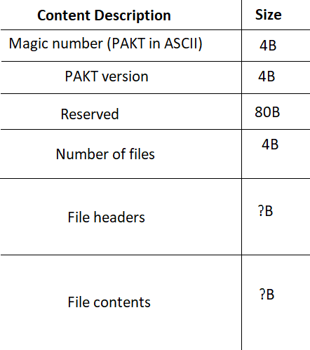
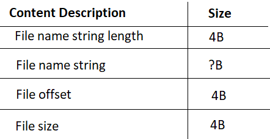

# Pakt

Uncompressed archive file format library.

## Motivation

I initially made this for [Tempeh Engine](https://github.com/shaderboi/tempeh-engine).

This file format was inspired by [Quake PAK format](https://quakewiki.org/wiki/.pak)

## Specification

### File Headers

## License

Licensed under [MIT](LICENSE-MIT) and [Apache License 2.0](LICENSE-APACHE)
